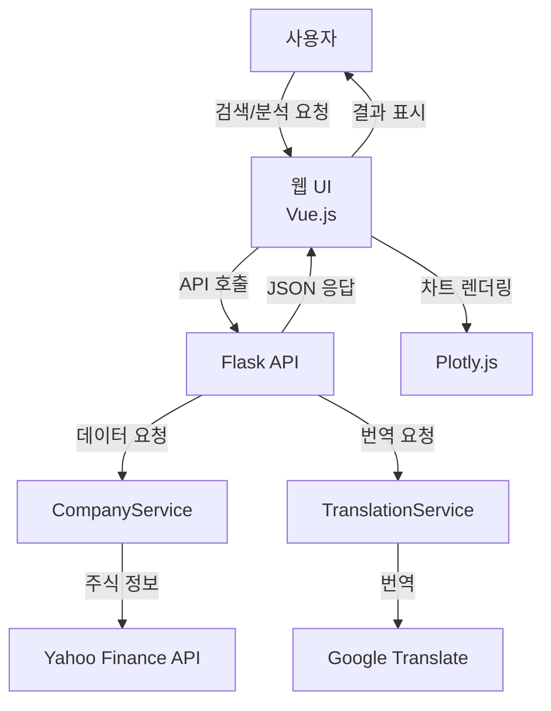

# 프로젝트 개선 사항

## 🔧 수행된 개선 작업

### 1. 코드 품질 개선

- ✅ **Black 포맷터 적용**: 일관된 코드 스타일 적용
- ✅ **isort 적용**: import 문 정렬 및 구조화
- ✅ **Flake8 린팅**: 코드 품질 문제 해결
- ✅ **Debug 모드 제거**: 프로덕션 환경 보안 강화

### 2. 프론트엔드 개선

- ✅ **API 통신 모듈 생성**: `api.js` 파일로 API 로직 분리
- ✅ **설정 파일 수정**: 로컬 개발 환경에 맞게 `config.js` 업데이트
- ✅ **에러 처리 강화**: API 에러 시 사용자 친화적 메시지 표시

### 3. 백엔드 개선

- ✅ **에러 메시지 개선**: 긴 에러 메시지 포맷 수정
- ✅ **서버 설정 개선**: 호스트와 포트 명시적 설정

### 4. 자동화 도구 추가

- ✅ **설정/테스트 스크립트**: `setup_and_test.py` 생성
- ✅ **환경 설정 예제**: `.env.example` 파일 (생성 시도)

## 📋 남은 작업 및 권장사항

### 1. E2E 테스트 활성화

```python
# tests/e2e/test_ui.py 수정 필요
@pytest.mark.skip 제거 후 실제 테스트 실행
```

### 2. 환경 변수 설정

```bash
# .env 파일 생성
FLASK_ENV=production
FLASK_APP=api.index
API_PORT=5000
```

### 3. 프론트엔드 개선사항

- 로딩 스피너 구현
- 에러 바운더리 추가
- 반응형 디자인 강화

### 4. 백엔드 개선사항

- 캐싱 전략 개선
- Rate limiting 구현
- API 버전 관리

### 5. 배포 준비

- Docker 컨테이너화
- CI/CD 파이프라인 설정
- 모니터링 도구 통합

## 🚀 빠른 시작 가이드

```bash
# 1. 의존성 설치
pip install -r requirements.txt
pip install -r requirements-dev.txt

# 2. 코드 품질 검사
black .
isort .
flake8 . --exclude=.venv,archive --max-line-length=88

# 3. 테스트 실행
pytest -v

# 4. 서버 시작
cd api
python index.py

# 5. 브라우저에서 접속
http://localhost:5000/docs/index.html
```

## 📊 프로젝트 구조



## 🔍 주요 기능

1. **회사 검색**: 심볼/이름으로 실시간 검색
2. **재무 분석**: 상세 재무지표 및 주가 히스토리
3. **다국어 지원**: 한국어, 영어, 일본어, 중국어
4. **시각화**: Plotly.js 기반 인터랙티브 차트
5. **비교 분석**: 여러 기업 동시 비교
6. **CSV 다운로드**: 분석 결과 내보내기
